# openclaw-ops `v1.1.0`

[English](README.md) | [中文](README_CN.md)

A skill that teaches any AI agent how to operate and maintain an [OpenClaw](https://openclaw.ai) Gateway running as a persistent service.

Works with **any agent that has shell access** — Claude Code, Codex, OpenClaw, Pi, or any AI agent with shell access running on the same machine as the OpenClaw Gateway.

Supports both **Linux (systemd)** and **macOS (launchd)**.

## Architecture

```mermaid
graph TB
    subgraph Server["🖥️ Server / Mac"]
        subgraph Main["Main OpenClaw Gateway"]
            A1[Agents]
            A2[Channels]
            A3[Sessions]
            A4[Cron Jobs]
        end
        subgraph Rescue["Rescue Agent<br/>Claude Code / secondary OC / any AI agent"]
            R1["🛠️ openclaw-ops skill installed"]
        end
        Rescue -- "🔧 diagnoses & fixes" --> Main
    end
    Main -. "systemd / launchd" .-> Users["👥 Users via Discord / Telegram / etc"]
    You["👤 You via SSH / VS Code / tmux"] -- "connect when main is down" --> Rescue
```



**Main OpenClaw Gateway** — Your primary AI agent system. Handles all day-to-day operations: chat channels, cron jobs, sessions, etc.

**Rescue Agent** — A separate agent (Claude Code, secondary OpenClaw instance, or any AI agent with shell access) with this skill installed. Lives on the same machine. Its sole purpose: fix the main gateway when it breaks, and perform operational health checks.

**This skill** — Teaches the rescue agent what commands to run, how to interpret output, and what steps to follow for diagnosis and repair.

## Two Core Scenarios

### 🔴 Rescue: Main Gateway is Down

The main OpenClaw is crashed, misconfigured, or won't start. You connect to the rescue agent and ask it to fix things.

```
You: "OpenClaw is down, can you check?"

Rescue agent: checks systemctl status → reads crash logs → finds ENOMEM →
reports "Out of memory, Node process killed. Memory usage is 94%.
Want me to free some memory and restart?"
```

### 🟢 Health Check: Main Gateway is Running

The main OpenClaw is working fine, but you want to verify health, update, or clean up.

```
You: "Run a health check on OpenClaw"

Rescue agent: runs openclaw doctor → reports status, orphan count,
channel connectivity, disk usage → offers to fix any issues found
```

## Connecting to the Rescue Agent

When the main OpenClaw is down, you can't talk to it through Discord/Telegram. You need an alternative way to reach the rescue agent on the server.

### Option 1: Claude Code via SSH (Recommended)

SSH into the server and run Claude Code directly:

```bash
ssh user@your-server
claude  # starts Claude Code with the skill available
```

For mobile access, use any SSH client app (Termius, Blink, etc.).

### Option 2: Claude Code Remote (VS Code)

Use [Claude Code](https://docs.anthropic.com/en/docs/claude-code) with VS Code Remote SSH:

1. VS Code → Remote-SSH → connect to your server
2. Open terminal → `claude`
3. The rescue agent has shell access and the skill

### Option 3: Secondary OpenClaw Instance

Run a second OpenClaw instance as the rescue agent with a different channel (e.g., Telegram if main uses Discord):

```bash
# Install as a separate service with different config
openclaw daemon install --name openclaw-rescue
```

This way if Discord is down or the main agent is unresponsive, you reach the rescue agent via Telegram.

### Option 4: Hoppscotch / API Client

If the rescue agent exposes an API endpoint, connect via any HTTP client from your phone:

```
POST https://your-server:port/api/chat
{ "message": "Check OpenClaw status" }
```

### Option 5: tmux + SSH

Leave a tmux session running with Claude Code:

```bash
# On the server (once)
tmux new -s rescue
claude

# Later, from anywhere via SSH
ssh user@your-server
tmux attach -t rescue
```

## Install

### Ask your agent to install it

Just tell your agent in a conversation:

```
> Install the openclaw-ops skill from https://github.com/dinstein/openclaw-ops-skill
```

The agent will download `SKILL.md` and place it in the correct skills directory automatically.

### From ClawHub

```bash
clawhub install openclaw-ops
```

### Manual

Copy `SKILL.md` into your agent's skills directory:

```bash
# Claude Code
mkdir -p ~/.claude/skills/openclaw-ops
cp SKILL.md ~/.claude/skills/openclaw-ops/SKILL.md

# OpenClaw
mkdir -p ~/.openclaw/workspace/skills/openclaw-ops
cp SKILL.md ~/.openclaw/workspace/skills/openclaw-ops/SKILL.md

# Other agents — place in whatever skills directory your agent reads from
```

## What it covers

| Module | Scenario | Description |
|--------|----------|-------------|
| Crash diagnosis | 🔴 Rescue | Read logs, identify root cause |
| Config repair | 🔴 Rescue | JSON fix, schema validation, common errors |
| Service restart | 🔴 Rescue | Safe restart after fixing root cause |
| Resource check | 🔴 Rescue | Disk, memory, Node.js, dependencies |
| Health check | 🟢 Health | `openclaw doctor`, service status |
| Update & upgrade | 🟢 Health | Version check, safe upgrade, rollback |
| Disk cleanup | 🟢 Health | Orphan transcripts, session management |
| Backup | 🟢 Health | Config, agents, workspace backup |
| Tailscale check | 🟢 Health | Reverse proxy verification |

## How it works

This is a **pure documentation skill** — no scripts, no external dependencies, no framework lock-in. Install it in any agent that can read markdown and run shell commands. It teaches the agent:

1. **What to check** — the right commands for each situation
2. **How to interpret** — what the output means and common error patterns
3. **What to do** — step-by-step fix procedures with safety guardrails
4. **How to verify** — confirmation steps after every action

## Safety

The skill enforces these rules:

- Always check logs before making changes
- Always backup config before editing
- Always validate JSON after editing
- Never print secrets (env files)
- Never delete workspace files without confirmation
- Always verify after restart

## License

MIT
