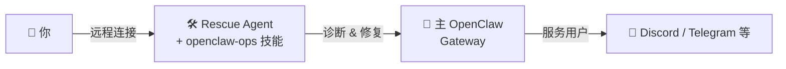

# openclaw-ops `v1.1.0`

[English](README.md) | [中文](README_CN.md)

一个教 AI Agent 如何运维 [OpenClaw](https://openclaw.ai) Gateway 的技能。

适用于**任何有 shell 访问权限的 Agent** — Claude Code、Codex、OpenClaw、Pi 或任何运行在 OpenClaw Gateway 同一台机器上的 AI Agent。

支持 **Linux (systemd)** 和 **macOS (launchd)**。

## 架构



**主 OpenClaw Gateway** — 你的主要 AI Agent 系统，处理日常操作：聊天频道、定时任务、会话等。

**Rescue Agent** — 一个独立的 Agent（Claude Code、备用 OpenClaw 实例或其他有 shell 访问权限的 AI Agent），安装了本技能。和主 Gateway 运行在同一台机器上。它的唯一职责：主 Gateway 出问题时修复它，以及执行运维健康检查。

**本技能** — 教会 Rescue Agent 该跑什么命令、如何解读输出、按什么步骤诊断和修复。

## 两个核心场景

### 🔴 救援：主 Gateway 挂了

主 OpenClaw 崩溃、配置损坏或无法启动。你连接到 Rescue Agent 让它修复。

```
你: "OpenClaw 挂了，帮我看看"

Rescue Agent: 检查 systemctl 状态 → 读取崩溃日志 → 发现 ENOMEM →
回复 "内存不足，Node 进程被杀。内存使用率 94%。
需要我释放一些内存然后重启吗？"
```

### 🟢 健康检查：主 Gateway 运行中

主 OpenClaw 正常运行，你想确认运行状态、升级或清理。

```
你: "检查一下 OpenClaw 的运行状况"

Rescue Agent: 运行 openclaw doctor → 报告状态、孤立文件数量、
频道连接情况、磁盘使用 → 提供修复建议
```

## 如何远程连接 Rescue Agent

主 OpenClaw 挂了之后，你无法通过 Discord/Telegram 和它对话。你需要其他方式连接服务器上的 Rescue Agent。

### 方案 1：原生远程控制（⭐ 推荐）

大多数编程 Agent 提供内置的远程访问功能。优先使用 — 体验最好，浏览器或手机直接操作。

- **Claude Code** — [Remote Control](https://code.claude.com/docs/en/remote-control)：从任何浏览器访问服务器上的 Claude Code
- **Codex** — 查看对应的远程访问文档

原生方案自带认证、会话保持和 UI，开箱即用。

### 方案 2：远程 Agent 管理平台

第三方平台，支持远程管理和操控服务器上的 Agent：

- [Hapi](https://hapi.com) — 远程 Agent 管理平台
- 类似支持远程 shell Agent 访问的产品

适合 Agent 没有原生远程控制、或者需要统一管理多个 Agent 的场景。

### 方案 3：SSH + Agent CLI

SSH 登录服务器，直接在终端运行 Agent：

```bash
ssh user@your-server
claude  # 或 codex，或任何 Agent CLI
```

**移动端技巧：**
- 使用 SSH 客户端 App（Termius、Blink 等）
- 用 tmux 保持会话：

```bash
# 服务器上（一次性设置）
tmux new -s rescue
claude

# 之后从任何地方
ssh user@your-server
tmux attach -t rescue
```

- VS Code Remote SSH 也很好用（笔记本场景）

## 安装

### 在对话中让 Agent 安装

直接在对话里告诉你的 Agent：

```
> 从 https://github.com/dinstein/openclaw-ops-skill 安装 openclaw-ops 技能
```

Agent 会自动下载 `SKILL.md` 并放到正确的技能目录。

### 通过 ClawHub

```bash
clawhub install openclaw-ops
```

### 手动安装

将 `SKILL.md` 复制到你的 Agent 技能目录：

```bash
# Claude Code
mkdir -p ~/.claude/skills/openclaw-ops
cp SKILL.md ~/.claude/skills/openclaw-ops/SKILL.md

# OpenClaw
mkdir -p ~/.openclaw/workspace/skills/openclaw-ops
cp SKILL.md ~/.openclaw/workspace/skills/openclaw-ops/SKILL.md

# 其他 Agent — 放到你的 Agent 读取技能文件的目录
```

## 功能覆盖

| 模块 | 场景 | 说明 |
|------|------|------|
| 崩溃诊断 | 🔴 救援 | 读取日志、定位根因 |
| 配置修复 | 🔴 救援 | JSON 修复、Schema 校验、常见错误 |
| 服务重启 | 🔴 救援 | 修复根因后安全重启 |
| 资源检查 | 🔴 救援 | 磁盘、内存、Node.js、依赖 |
| 健康检查 | 🟢 运维 | `openclaw doctor`、服务状态 |
| 更新升级 | 🟢 运维 | 版本检查、安全升级、回滚 |
| 磁盘清理 | 🟢 运维 | 孤立 transcript、会话管理 |
| 备份 | 🟢 运维 | 配置、agents、workspace 备份 |
| Tailscale 检查 | 🟢 运维 | 反向代理验证 |

## 工作原理

这是一个**纯文档技能** — 无脚本、无外部依赖、无框架绑定。安装到任何能读取 Markdown 并执行 shell 命令的 Agent 中即可。它教会 Agent：

1. **检查什么** — 每种场景对应的正确命令
2. **如何解读** — 输出含义和常见错误模式
3. **怎么修复** — 带安全护栏的逐步修复流程
4. **如何验证** — 每个操作后的确认步骤

## 安全规则

- 修改前必须先查日志
- 编辑配置前必须备份
- 编辑后必须校验 JSON
- 不打印敏感信息（env 文件）
- 不删除 workspace 文件，除非用户确认
- 重启后必须验证服务状态

## 许可证

MIT
